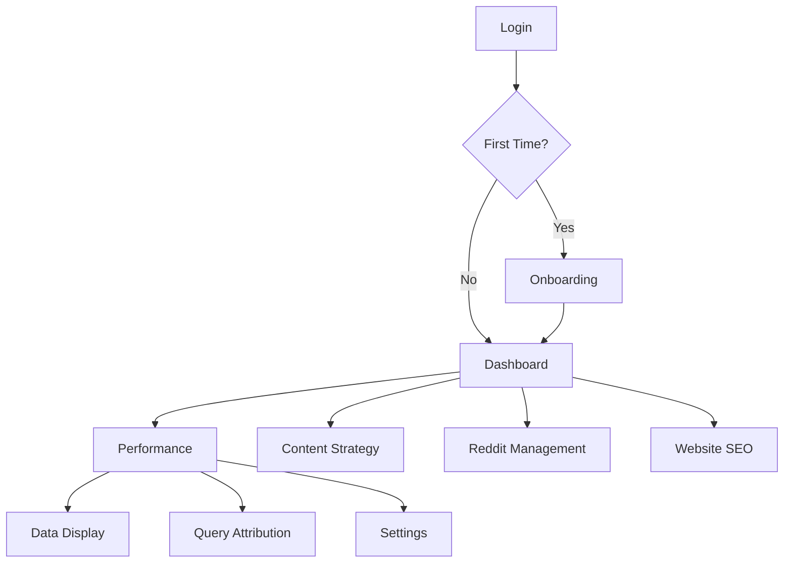

## 1. Product Overview

WorkfxAI Dashboard 是一个一站式品牌监控与增长平台，帮助用户追踪AI平台提及、社媒口碑和网站SEO表现。通过整合GA4、AI搜索和社媒数据，为品牌主提供可操作的洞察，提升线上可见度和用户获取效率。

目标用户：需要监控品牌在多平台表现、优化内容策略的中小企业主、市场运营人员。

## 2. Core Features

### 2.1 User Roles（状态机）

| 状态                  | 界面表现                                            |
| ------------------- | ----------------------------------------------- |
| Free User（注册未付费）    | 只展示一个静态的图片(折线图),然后有一个按钮是点击解锁，点击升级，然后就跳转到付费墙的页面。 |
| Pending User（付费未解锁） | 这个部分你先做成空白吧，然后加一个按钮是前去设置按钮，然后后面我们再调样式。          |
| Active User（付费已配置）  | 侧边栏显示Performance页面展示完整图表和数据                     |

### 2.2 Debug & State Management

* **调试按钮**：全局浮动按钮，位置固定在右下角（距边24px）

* **状态切换**：点击后可循环切换当前会话状态（Free → Pending → Active）

* **即时生效**：切换后立即更新UI表现，无需刷新页面

* **开发用途**：用于快速验证不同用户旅程下的界面展示效果

### 2.3 Feature Module

核心页面（按侧边栏顺序）：

1. **Quick Check**:空白页即可
2. **Performance（监控中心）**: 流量趋势、归因矩阵、设置三大子模块。

### 2.4 Page Details

| Page Name                       | Module Name             | Feature description                                                                           |
| ------------------------------- | ----------------------- | --------------------------------------------------------------------------------------------- |
| Dashboard                       | Health Score Card       | 显示55/100综合得分，含AI提及、社媒、SEO子项；点击跳对应模块。                                                          |
| Dashboard                       | Competitor Table        | 对比5家竞品在AI/社媒/SEO的得分与差距；支持添加/删除竞品。                                                             |
| Performance - Data Display      | KPIs                    | 实时卡片：Total Organic（GA4）、AI Direct Referral（chatgpt+perplexity）、Social Referral（reddit+zhihu）。 |
| Performance - Data Display      | Dual-axis Chart         | X轴时间（≥2天粒度），左Y总自然流量，右Y AI+社媒引荐；平台筛选、hover详情。                                                  |
| Performance - Query Attribution | 25×5 Matrix             | 5关键词×5查询×多平台，状态图标✅❌⚠️；点击展开抽屉含快照、情感、引用链接。                                                      |
| Performance - Settings          | Platform & Frequency    | 多选AI平台（chatgpt/perplexity…），监测频率默认2天。                                                         |
| Performance - Settings          | Keyword & Query Manager | 增删改5组关键词与5组查询；即时验证格式。                                                                         |
| Performance - Settings          | GA4 OAuth               | 一键授权或跳过；跳过则在图表显示占位符并提示 reconnect。                                                             |
| Performance - Data Display      | Free状态展示                | 模糊背景遮罩，居中显示"Subscribe to Unlock"CTA按钮，点击跳转付费页。                                                |
| Performance - Data Display      | Pending状态展示             | 数据卡片显示"Data Source Not Connected"占位符，提供"Connect GA4"按钮引导完成配置。                                 |
| Performance - Query Attribution | Free状态展示                | 矩阵区域模糊处理，显示"Upgrade to View Insights"提示。                                                      |
| Performance - Query Attribution | Pending状态展示             | 矩阵显示"Setup Required"图标，点击任意单元格提示"Complete GA4 connection"。                                    |
| Onboarding                      | Stepper                 | 首次进入自动弹出：①选平台→②确认关键词→③设频率→④连接GA4（可跳过）。                                                        |

## 3. Core Process

### 3.1 用户状态切换说明

系统基于三种状态控制界面展示：

1. **Free User进入流程**：注册登录 → Dashboard可见 → 点击Performance → 显示升级提示 → 可跳转付费
2. **Pending User进入流程**：支付成功 → Dashboard可见 → 点击Performance → 显示"Setup Required" → 引导完成GA4配置
3. **Active User进入流程**：配置完成 → 全功能开放 → 正常使用所有模块

### 3.2 首次使用流程（Pending/Active状态）

1. 注册/登录 → 2. Onboarding引导完成平台&关键词配置 → 3. 进入Dashboard查看健康评分 → 4. 点击Performance → 5. 根据状态显示对应界面 → 6. 必要时回到Settings调整监测参数

### 3.3 日常监控流程（Active状态）

登录 → Dashboard概览 → 侧边栏直达对应模块 → 按天/周查看报告 → 导出或分享

### 3.4 Debug流程

任意页面 → 点击右下角Debug按钮 → 循环切换用户状态 → 即时查看不同状态下的UI表现



## 4. User Interface Design

### 4.1 Design Style

* 主色：#0EA5E9（sky-500），辅色：#10B981（emerald-500）。

* 按钮：圆角8px，主按钮实心，次按钮描边；hover微阴影。

* 字体：Inter 14-16px正文，20px标题；数字使用Tabular Numbers。

* 布局：左侧固定200px侧边栏+右侧卡片式内容区；卡片圆角12px，白色背景，1px边框#E5E7EB。

* 图标：线性heroicons，状态图标✅❌⚠️使用彩色emoji。

### 4.2 Page Design Overview

| Page Name                       | Module Name       | UI Elements                                                                                                              |
| ------------------------------- | ----------------- | ------------------------------------------------------------------------------------------------------------------------ |
| Dashboard                       | Health Score Card | 圆形进度条+大数字55/100，下方三枚小进度条（AI/社媒/SEO），颜色按得分映射红/黄/绿。                                                                        |
| Dashboard                       | Competitor Table  | 表头冻结，行高48px，得分列使用相同进度条微型版；最后一列操作图标（外链/删除）。                                                                               |
| Performance - Data Display      | Free状态遮罩          | 全屏半透明黑色遮罩（opacity-75），居中白色卡片：大标题"Unlock Full Insights"，副标题"Subscribe to view detailed analytics"，蓝色CTA按钮"Subscribe Now"。 |
| Performance - Data Display      | Pending状态提示       | 数据卡片替换为灰色占位符，图标⚠️，文字"Data Source Not Connected"，蓝色链接"Connect GA4"。                                                       |
| Performance - Query Attribution | Free状态遮罩          | 矩阵区域高斯模糊，上方叠加白色提示条"🔒 Upgrade to view keyword insights"，右侧"Upgrade"按钮。                                                   |
| Performance - Query Attribution | Pending状态提示       | 矩阵单元格显示灰色禁用状态，hover提示"Complete setup to enable tracking"。                                                                |
| Performance - Settings          | Keyword Input     | 每行一对输入框（关键词+查询），拖拽排序手柄；保存按钮置底sticky。                                                                                     |
| Global                          | Debug Button      | 右下角圆形按钮（56×56px），齿轮图标⚙️，背景#8B5CF6，hover加深；点击展开状态选择面板。                                                                    |
| Sidebar                         | Free状态显示          | 顶部用户区域显示"Starter Plan"，底部突出"Upgrade"按钮（实心主色）。                                                                            |
| Sidebar                         | Pending/Active显示  | 顶部显示"Pro Plan"，底部"Upgrade"按钮消失；Active用户显示配置状态指示器✅。                                                                       |

### 4.3 Performance Page Wireframe (Data Display Tab)

```text
+-----------------------------------------------------------------------------------------------+
|  [Data Display]    [Query Attribution]    [Setting]                                           |
+-----------------------------------------------------------------------------------------------+
|                                                                                               |
|  +--------------------------+    +--------------------------+    +--------------------------+ |
|  | Total Organic            |    | AI Direct Referral       |    | Social Referral          | |
|  |                          |    |                          |    |                          | |
|  |   12,500                 |    |   1,200  (15%)           |    |   850  (8%)              | |
|  |                          |    |                          |    |                          | |
|  |   (Source: GA4)          |    |   (ChatGPT, Perplexity)  |    |   (Reddit, Zhihu)        | |
|  +--------------------------+    +--------------------------+    +--------------------------+ |
|                                                                                               |
+-----------------------------------------------------------------------------------------------+
|  [ Chart Control Bar ]                                                                        |
|  Filter: [All AI] [ChatGPT] [Claude]  |  [All Social] [Reddit] [Zhihu]                        |
+-----------------------------------------------------------------------------------------------+
|                                                                                               |
|  (Left Y: Total Organic)                                            (Right Y: AI/Social)      |
|  |                                                                                         |  |
|  |          /-----\   Total (Blue Line)                                                |  |
|  |         /       \                                                                   |  |
|  |        /         \-----------------                                                 |  |
|  |                                                                                         |  |
|  |                  /------\  AI (Green Line)                                          |  |
|  |      -----------/        \                                                          |  |
|  |                                                                                         |  |
|  +-----------------------------------------------------------------------------------------+  |
|      Day 1      Day 3      Day 5      Day 7      Day 9      ...                               |
|                                                                                               |
+-----------------------------------------------------------------------------------------------+
```

### 4.4 Responsiveness

桌面优先（1440px基准），适配1280-1920px；平板横向保留侧边栏，纵向折叠为顶部Tab；手机端仅提供核心Dashboard与Performance只读视图，复杂配置需桌面完成。

