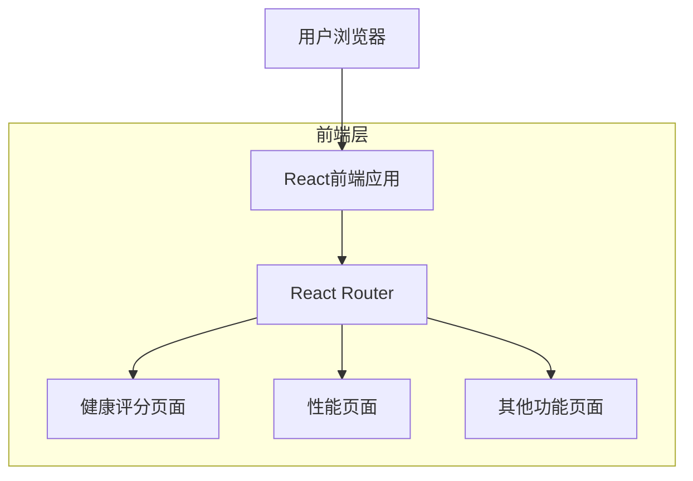

## 1. 架构设计



## 2. 技术描述

- 前端：React@18 + Tailwind CSS@3 + Vite
- 初始化工具：vite-init
- 路由管理：React Router@6
- 状态管理：React Context API
- 后端：无（纯前端应用）

## 3. 路由定义

| 路由 | 用途 |
|------|------|
| / | 健康评分页面，显示网站整体评分和竞争对手对比 |
| /performance | 性能页面，显示网站性能监控数据（重点开发）|
| /content-strategy | 内容策略页面，显示内容优化建议 |
| /reddit-management | Reddit管理页面，社交媒体管理工具 |
| /product-listing | 产品列表页面，产品页面优化功能 |
| /tech-assessment | 技术评估页面，技术错误检测和修复 |
| /website-seo | 网站SEO页面，SEO优化工具 |
| /explore | 探索WorkfxAI页面，平台功能介绍 |
| /account | 账户设置页面，用户个人信息管理 |

## 4. 组件架构

### 4.1 核心组件结构
```
src/
├── components/
│   ├── Layout/
│   │   ├── Sidebar.jsx          # 左侧导航栏
│   │   ├── Header.jsx           # 顶部标题
│   │   └── MainContent.jsx      # 主内容区域
│   ├── HealthScore/
│   │   ├── ScoreCard.jsx        # 评分卡片
│   │   ├── MetricsList.jsx      # 指标列表
│   │   ├── CompetitorTable.jsx  # 竞争对手表格
│   │   └── StrategyBanner.jsx   # 策略横幅
│   ├── Performance/
│   │   ├── PerformanceChart.jsx # 性能图表
│   │   └── PerformanceMetrics.jsx # 性能指标
│   └── Common/
│       ├── Button.jsx           # 通用按钮
│       ├── Card.jsx            # 通用卡片
│       └── Icon.jsx            # 图标组件
├── pages/
│   ├── HealthScore.jsx         # 健康评分页面
│   ├── Performance.jsx          # 性能页面（重点）
│   └── PlaceholderPage.jsx      # 占位页面模板
├── hooks/
│   ├── useNavigation.js         # 导航逻辑
│   └── usePerformance.js        # 性能数据逻辑
└── utils/
    ├── constants.js              # 常量定义
    └── mockData.js              # 模拟数据
```

### 4.2 状态管理
使用React Context API管理全局状态：
- 当前激活的导航项
- 用户基本信息
- 页面加载状态

### 4.3 样式系统
- 使用Tailwind CSS进行样式设计
- 自定义颜色配置匹配品牌色
- 响应式断点：移动端(<768px)、平板(768px-1024px)、桌面(>1024px)

## 5. 数据模型

### 5.1 评分数据结构
```typescript
interface ScoreData {
  overallScore: number;
  maxScore: number;
  tier: 'A' | 'B' | 'C' | 'D';
  metrics: {
    aiCitationRate: { score: number; max: number };
    contentAuthority: { score: number; max: number };
    structuredData: { score: number; max: number };
    contentRichness: { score: number; max: number };
    semanticOptimization: { score: number; max: number };
  };
}
```

### 5.2 竞争对手数据
```typescript
interface Competitor {
  rank: number;
  brand: string;
  domain: string;
  metrics: {
    aiCitationRate: number;
    contentAuthority: number;
    structuredData: number;
    contentRichness: number;
    semanticOptimization: number;
  };
  totalScore: number;
  tier: 'A' | 'B' | 'C' | 'D';
}
```

### 5.3 导航菜单结构
```typescript
interface MenuItem {
  id: string;
  label: string;
  path: string;
  sublabel?: string;
  icon?: string;
  children?: MenuItem[];
  isComingSoon?: boolean;
}
```

## 6. 性能优化策略

### 6.1 代码分割
- 使用React.lazy进行路由级别的代码分割
- 组件级别的按需加载

### 6.2 渲染优化
- 使用React.memo优化重渲染
- 合理使用useMemo和useCallback

### 6.3 资源优化
- 图片懒加载
- CSS和JS文件压缩
- 使用CDN加速静态资源

## 7. 开发规范

### 7.1 命名规范
- 组件名使用PascalCase
- 变量和函数使用camelCase
- 常量使用UPPER_SNAKE_CASE

### 7.2 文件组织
- 每个组件单独文件夹，包含.jsx和对应样式
- 页面组件放在pages目录
- 可复用组件放在components目录

### 7.3 代码风格
- 使用ESLint进行代码检查
- 使用Prettier进行代码格式化
- 遵循React最佳实践